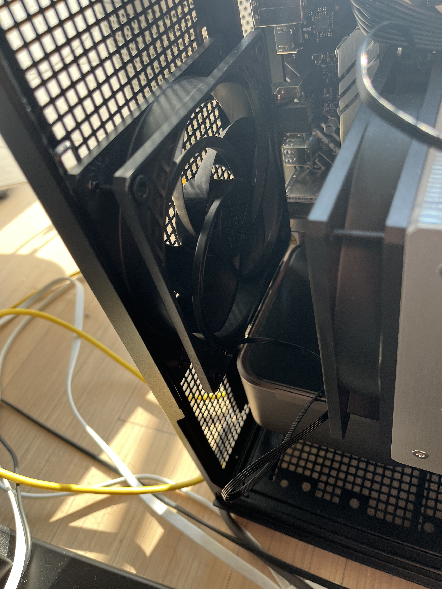
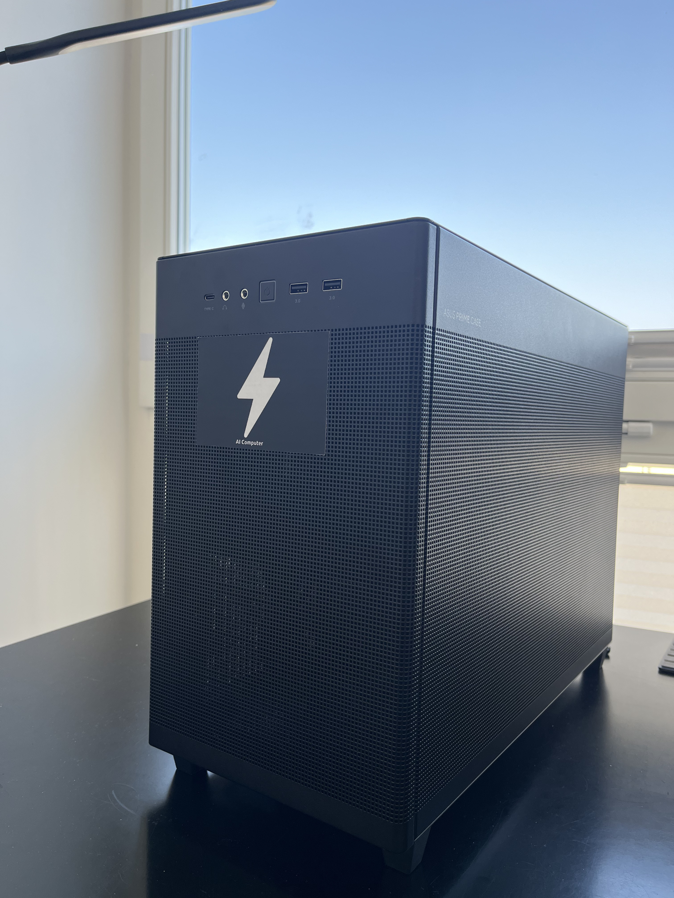
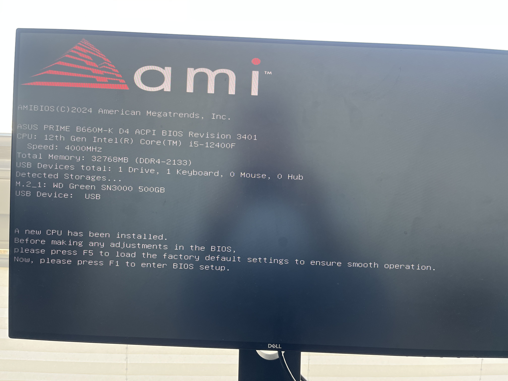

# aicomputer


This is a guide on how you can build a low-cost (<$1,300) AI computer by yourself to run your AI flows locally.

Ideal for students on a low budget. The build can, of course, also be expanded and constructed in a way to offer the best performance for enterprises, for example.

## Table of Contents

- [Parts List](#parts-list)
- [Assembly Guide](#assembly-guide)
- [Installation](#ubuntu-installation)
- [Remote Access Setup](#remote-access-setup)

## Parts List

| Component       | Model                                                                                                                                       |
| --------------- | ------------------------------------------------------------------------------------------------------------------------------------------- |
| **GPU**         | RTX 3090 FE (used)                                                                                                                          |
| **CPU**         | [Intel i5 12400F](https://www.notebooksbilliger.de/intel+core+i5+12400f+746282)                                                             |
| **Motherboard** | [Asus PRIME B660M-K D4](https://www.notebooksbilliger.de/asus+prime+b660m+k+d4+mainboard+748894)                                            |
| **RAM**         | [Corsair Vengeance LPX 32GB (2x16GB)](https://www.notebooksbilliger.de/corsair+vengeance+lpx+schwarz+32gb+kit+2x16gb+ddr4+3200+cl16+660264) |
| **Storage**     | [WD Green SN3000 500GB NVMe](https://www.notebooksbilliger.de/wd+green+sn3000+ssd+500gb+m2+2280+pcie+gen4+nvme+873474)                      |
| **PSU**         | [MSI MAG A750GL PCIE5 750W](https://www.amazon.de/dp/B0C3M86HCB)                                                                            |
| **CPU Cooler**  | [ARCTIC Freezer 36](https://www.notebooksbilliger.de/arctic+freezer+36+cpu+khler+827131)                                                    |
| **Case Fans**   | [4x ARCTIC P12 PWM](https://www.amazon.de/dp/B07GB5JRTZ)                                                                                    |
| **Case**        | [ASUS Prime AP201 MicroATX](https://www.amazon.de/dp/B0B7F8C35R)                                                                            |

_Note: Links are to German retailers but parts are available worldwide_

## Assembly Guide

1. Unpack all components
2. Install CPU on motherboard
3. Mount CPU cooler
4. Install RAM modules
5. Install M.2 SSD
6. Mount motherboard in case
7. Connect front panel cables
8. Install power supply
9. Install exhaust fan:
   
10. Install GPU
11. Close case, should be looking like:
    

## Installation

1. Connect:
   - Ethernet cable to router
   - Keyboard to motherboard USB
   - Monitor to GPU (not motherboard)
2. Download [Ubuntu Server](https://ubuntu.com/download/server)
3. Create bootable USB
4. Insert USB into motherboard port
5. Power on (PSU switch to 'I')
6. Enter BIOS/boot menu:
   
7. Select USB boot device:
   
8. Complete Ubuntu installation with SSH server enabled

## Remote Access Setup

After installation, you can SSH from any device on your network:

```bash
ssh username@192.168.2.x  # Replace with your machine's IP
```

## Usage

Ready to use with GPU-accelerated models from [Ollama](https://ollama.com) and other AI frameworks.

## Need Help?

Reach out to me on X [@yachty66] for build assistance or questions!
